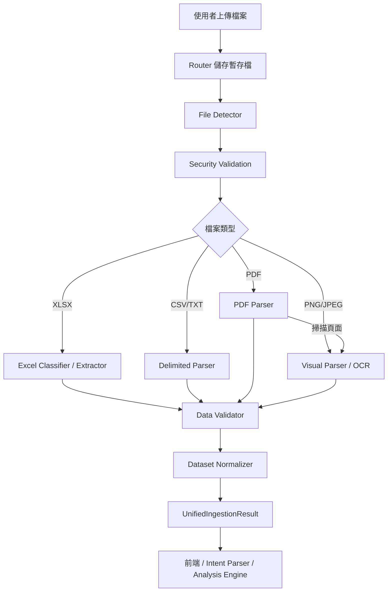

# 智匯數據簡報神器：共同開發指南

> 本文件用於協助共同開發者快速理解目前已完成的系統、模組邊界、資料流、共用介面與協作規範。  
> 專案目前完成的是 **Ingestion／資料輸入與標準化模組**，下一階段預計串接 Intent Parser、資料分析引擎與簡報生成模組。

---

## 1. 專案目標

本系統的最終目標是：

```text
使用者上傳資料與輸入簡報需求
→ 系統理解使用者意圖
→ 讀取並整理資料
→ 執行分析
→ 規劃簡報敘事與圖表
→ 產生簡報
```

目前已完成的部分是：

```text
使用者上傳檔案
→ 檔案格式辨識
→ 安全檢查
→ 內容分類
→ 表格／文字／OCR 抽取
→ 資料品質驗證
→ 統一轉換成 DatasetSpec
→ 人工確認流程
```

---

## 2. 目前專案結構

```text
backend/
├─ app/
│  ├─ __init__.py
│  ├─ main.py
│  └─ ingestion/
│     ├─ __init__.py
│     ├─ router.py
│     ├─ pipeline.py
│     ├─ schemas.py
│     ├─ detector.py
│     ├─ security.py
│     ├─ settings.py
│     ├─ classifier.py
│     ├─ extractor.py
│     ├─ validator.py
│     ├─ normalizer.py
│     ├─ delimited.py
│     ├─ pdf_parser.py
│     └─ visual_parser.py
├─ tests/
├─ pytest.ini
└─ requirements-lock.txt
```

---

## 3. 模組責任

### `main.py`

FastAPI 應用程式入口。

主要責任：

- 建立 `FastAPI` instance
- 掛載 ingestion router
- 提供 `/health`
- 提供 `/ready`

不應在這裡放：Dataset 建立、OCR、Excel 解析或資料驗證邏輯。

### `router.py`

HTTP API 層。

主要責任：

- 接收上傳檔案
- 處理 `multipart/form-data`
- 暫存與清理檔案
- 呼叫 Pipeline
- 回傳結果
- 處理 Dataset 人工確認

目前主要 API：

```text
POST /ingestion/process
POST /ingestion/review-dataset
```

`/ingestion` prefix 只能加一次。以下兩種寫法擇一：

```python
router = APIRouter(prefix="/ingestion")
app.include_router(router)
```

或：

```python
router = APIRouter()
app.include_router(router, prefix="/ingestion")
```

不可兩邊都加，否則會變成：

```text
/ingestion/ingestion/process
```

### `pipeline.py`

整個資料輸入流程的協調者。

主要責任：

1. 檔案檢查
2. 安全驗證
3. 內容分類
4. 表格抽取
5. 品質驗證
6. Dataset 正規化
7. 組合 `UnifiedIngestionResult`

目前 Pipeline 階段名稱：

```text
file_inspection
security_validation
content_classification
table_extraction
data_validation
dataset_normalization
```

### `schemas.py`

**所有模組共用資料格式的唯一來源。**

跨模組資料應優先使用 Pydantic Model，不要使用任意 Dictionary。

核心輸出：

```python
UnifiedIngestionResult
```

其中包含：

```text
inspection
classification
document
visual
extraction
validation
datasets
review_required_count
stages
warnings
errors
```

修改 `schemas.py` 前，必須確認是否會影響 Pipeline、Router、Tests、Intent Parser、Analysis Engine 與前端。

### `detector.py`

負責：

- 判斷真實檔案類型
- 檢查副檔名與內容是否一致
- 空檔案、可讀性、加密狀態

支援格式：

```text
XLSX
CSV
TXT／TSV
PDF
PNG
JPEG
```

### `security.py`

負責：

- 檔案大小限制
- XLSX ZIP 結構檢查
- ZIP path traversal 防護
- ZIP bomb／異常壓縮比例防護

安全錯誤應回傳：

```text
pipeline_status = rejected
```

### `settings.py`

集中管理 Ingestion 設定，例如：

```text
MAX_UPLOAD_BYTES
UPLOAD_CHUNK_BYTES
MAX_XLSX_ENTRIES
MAX_XLSX_UNCOMPRESSED_BYTES
MAX_XLSX_COMPRESSION_RATIO
```

共用限制值不要散落在不同檔案。

### `classifier.py`

負責 Excel 內容分類：

- 結構化表格辨識
- 表頭列偵測
- 財務報表判斷
- 圖表、圖片、公式與合併儲存格偵測
- 信心分數與證據

### `extractor.py`

負責 Excel 表格抽取：

- 欄位與資料列
- 公式
- 儲存格範圍
- 來源證據
- 忽略非表格工作表

### `delimited.py`

負責 CSV、TSV、TXT：

- 編碼偵測
- 分隔符號偵測
- UTF-8、CP950 等編碼
- 表格抽取

### `pdf_parser.py`

負責：

- 判斷 PDF 是否有文字層
- 擷取文字
- 偵測可用表格
- 避免把段落誤判成表格
- 標記掃描頁面 OCR 需求
- 保存頁碼證據

### `visual_parser.py`

負責圖片與掃描 PDF OCR：

- PaddleOCR 初始化
- OCR 文字抽取
- 表格辨識
- 圖片內容分類
- OCR 信心分數
- 人工確認標記

測試原則：

- 一般測試使用 FakeEngine
- 真實 OCR 測試標記為 `slow`
- 不要讓每次 pytest 都載入 OCR 模型

### `validator.py`

目前檢查：

- 重複資料
- 缺失值
- 欄位型態不一致
- 財務報表平衡
- 無法解析的值

驗證狀態：

```text
pass
warning
error
```

### `normalizer.py`

負責把不同來源轉換成統一資料集：

- 建立 `UnifiedDatasetSpec`
- 產生穩定且與內容相關的 `dataset_id`
- 保存欄位、資料列、來源證據與信心分數
- 判斷是否需要人工確認
- 套用人工修正

---

## 4. 資料流程



---

## 5. 核心 API 契約

### 處理上傳檔案

```text
POST /ingestion/process
Content-Type: multipart/form-data
```

欄位：

```text
file: required
sheet_name: optional
```

`sheet_name` 沒有指定時應傳送空值，不要傳送字串 `"string"`。

回傳核心格式：

```json
{
  "filename": "sales.xlsx",
  "pipeline_status": "completed",
  "inspection": {},
  "classification": {},
  "extraction": {},
  "validation": {},
  "datasets": [],
  "review_required_count": 0,
  "stages": [],
  "warnings": [],
  "errors": []
}
```

### 人工確認資料集

```text
POST /ingestion/review-dataset
```

用途：

- 核准 OCR 結果
- 修正錯誤值
- 拒絕不可信資料
- 保存審查者與備註

---

## 6. 跨模組共用欄位名稱

以下欄位屬於 API／Schema 契約，請勿自行改名：

```text
dataset_id
name
columns
records
confidence
requires_human_review
review_status
evidence
pipeline_status
sheet_name
review_required_count
```

錯誤：

```python
dataset["data_set_id"]
dataset["rows"]
dataset["need_review"]
```

正確：

```python
dataset.dataset_id
dataset.records
dataset.requires_human_review
```

---

## 7. 命名規則

Python 函式與變數使用 `snake_case`：

```python
run_ingestion_pipeline
review_required_count
dataset_id
```

Class 使用 `PascalCase`：

```python
UnifiedDatasetSpec
PipelineStageResult
SourceEvidence
```

常數使用 `UPPER_SNAKE_CASE`：

```python
MAX_UPLOAD_BYTES
UPLOAD_CHUNK_BYTES
```

Enum value 使用 `lower_snake_case`。

---

## 8. 共用介面修改規範

以下屬於 Breaking Change：

- 修改 Pydantic 欄位名稱
- 修改 API path
- 修改函式參數
- 修改 Enum value
- 修改 Dataset 結構
- 修改 Pipeline Stage 名稱
- 修改資料庫欄位

PR 必須說明：

```text
1. 修改原因
2. 受影響模組
3. 舊格式
4. 新格式
5. 遷移方式
6. 測試結果
```

---

## 9. 測試規範

一般測試：

```powershell
python -m pytest -m "not slow" -v
```

真實 OCR 測試：

```powershell
python -m pytest -m slow -v
```

單一測試檔：

```powershell
python -m pytest tests\test_ingestion_pipeline.py -v
```

目前測試涵蓋：

```text
檔案辨識
Excel 分類與抽取
CSV／TXT
PDF
OCR FakeEngine
資料驗證
Dataset 正規化
安全檢查
Pipeline 整合
Dataset ID 穩定性
```

新增功能時應同步新增測試。

---

## 10. 開發環境

專案路徑範例：

```text
C:\Users\brian\llmanage-slidegen-dataeng\backend
```

啟動虛擬環境：

```powershell
..\.venv\Scripts\Activate.ps1
```

安裝依賴：

```powershell
python -m pip install -r requirements-lock.txt
```

啟動後端：

```powershell
python -m uvicorn app.main:app --reload
```

Swagger：

```text
http://127.0.0.1:8000/docs
```

健康檢查：

```text
http://127.0.0.1:8000/health
http://127.0.0.1:8000/ready
```

---

## 11. Git 協作規範

推薦分支：

```text
main
develop
feature/ingestion
feature/intent-parser
feature/data-analysis
feature/presentation-generator
fix/xxx
```

每位開發者應：

```text
1. 從 develop 建立 feature branch
2. 僅修改自己負責的模組
3. 定期同步 develop
4. 提交前執行測試
5. 透過 Pull Request 合併
6. 不直接 push 到 main
```

Commit message 範例：

```text
feat(ingestion): add scanned PDF OCR support
fix(pipeline): preserve datasets in final result
test(security): add zip traversal rejection test
docs(architecture): add shared schema guideline
```

---

## 12. Pull Request Checklist

```text
[ ] 程式可正常 import
[ ] 非 slow 測試全部通過
[ ] 新功能已有測試
[ ] 沒有直接修改不屬於自己的模組
[ ] 沒有任意更改共用 Schema
[ ] API path 沒有重複 prefix
[ ] 暫存檔會在 finally 中清理
[ ] OCR 不會在應用啟動時自動初始化
[ ] 錯誤訊息足夠清楚
[ ] README／Guideline 已同步更新
```

---

## 13. 與後續模組整合

Ingestion 的最終輸出是：

```python
UnifiedIngestionResult
```

後續模組不應重新解析原始 Excel、PDF 或圖片，而應直接使用：

```python
result.datasets
```

預期串接方式：

```python
ingestion_result = run_ingestion_pipeline(file_path)

datasets = ingestion_result.datasets
intent = parse_user_intent(user_prompt)

analysis_result = analyze_datasets(
    datasets=datasets,
    intent=intent,
)

presentation_plan = build_presentation_plan(
    analysis=analysis_result,
    intent=intent,
)
```

---

## 14. 已完成與未完成範圍

### 已完成

```text
Excel／CSV／TXT／PDF／圖片讀取
格式與內容辨識
表格抽取
OCR
資料品質驗證
統一 DatasetSpec
來源證據
信心分數
人工確認
上傳安全
暫存檔清理
FastAPI API
整合測試
```

### 尚未完成

```text
Intent Parser
自然語言需求理解
資料分析引擎
圖表推薦
簡報敘事規劃
PPT 生成
資料集資料庫保存
資料集查詢 API
前端上傳與結果預覽
使用者與權限管理
```

---

## 15. 最重要的協作原則

不需要所有人把函式內部變數取成完全相同的名稱。

真正需要統一的是：

```text
Schema
API 契約
函式輸入與輸出
Enum
資料庫欄位
Pipeline 階段
模組責任
```

> 模組內部可以自行實作，但模組之間的接口必須一致。

修改共用接口前，必須先更新規格、同步依賴模組並補上測試。
